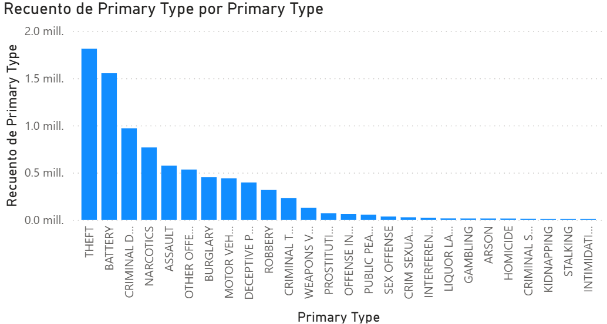

# Urban Crime Analysis

Data analysis project using crime data from the Chicago Police Department.

## Project Overview

This project analyzes crime patterns in Chicago using Python, exploratory data analysis, and data visualization.

Key goals:

- Identify the most common crime types
- Analyze crime trends over time
- Explore temporal crime patterns
- Visualize spatial crime distribution

## Dataset

Source: Chicago Police Department

Dataset contains more than 8.5 million crime records.

## Technologies Used

- Python
- pandas
- matplotlib
- seaborn
- folium
- Power BI

## Key Insights

- Theft is the most common crime.
- Crime peaks around midnight.
- Crime rates increase during summer months.
- Only ~25% of crimes lead to arrests.

## Visualizations

### Crimes per Year

### Top Crime Types

